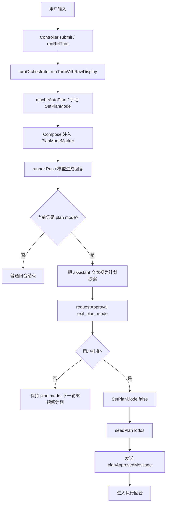
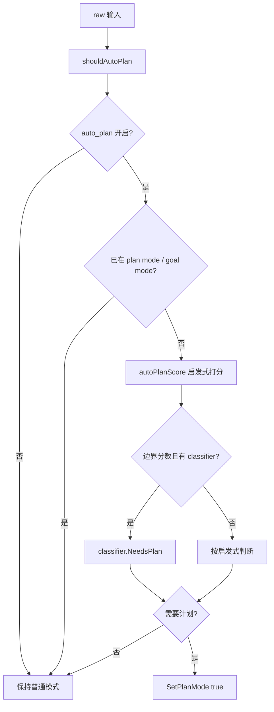
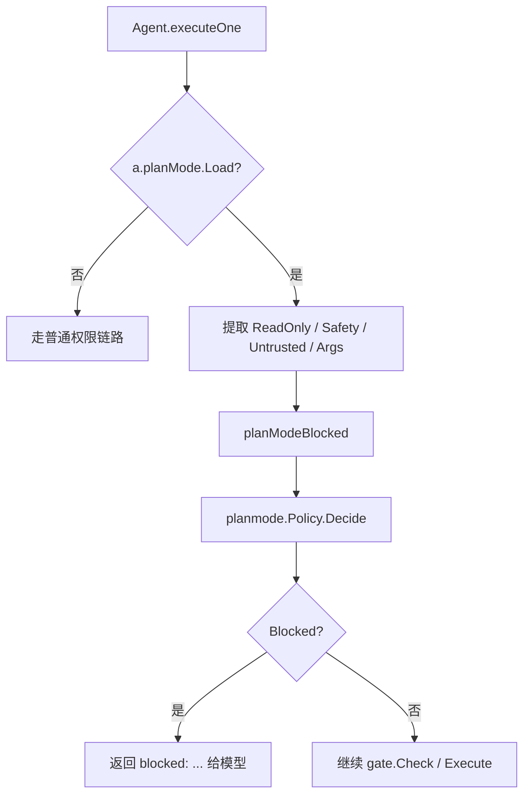

# Plan 模式调用链说明

这份文档专门解释 Reasonix 里 plan 模式的调用链：  
从用户输入进入控制器、何时切到 plan mode、plan mode 如何影响发给模型的文本、工具调用时如何真正被拦截，以及计划审批通过后如何切回执行阶段。

相关实现主要在：

- `internal/control/controller.go`
- `internal/control/turn_orchestrator.go`
- `internal/control/input.go`
- `internal/control/auto_plan.go`
- `internal/agent/agent.go`
- `internal/planmode/policy.go`

## 一句话结论

plan 模式不是“切一套新 prompt + 新工具列表”的粗暴模式切换。  
它是三层配合：

- **进入时机层**：控制器决定这一轮要不要进入 plan mode；
- **提示注入层**：Compose 给用户消息前面加 `PlanModeMarker`；
- **执行闸门层**：Agent 在真正跑工具前，用 `planmode.Policy` 拦住不允许的调用。

所以 plan 模式的核心不是“模型被动看到一个标签”，而是：

1. 控制器把“现在在规划”这个状态传下去；
2. 模型收到 marker，知道这一轮该产出计划；
3. 即使模型误调用 writer / side-effect tool，执行层也会硬拦截。

## 总体流程图

## 第一段：输入如何进入 plan 模式链路

普通交互输入最终都会汇到：

- `Controller.runTurn(...)`
- `Controller.runGoalLoopWithRawDisplay(...)`
- `turnOrchestrator.runTurnWithRawDisplay(...)`

其中真正的主编排点是：

- `internal/control/turn_orchestrator.go`

这里做四件事：

1. `maybeSessionStart(...)`
2. `maybeAutoPlan(ctx, raw)`
3. `Compose(input)`
4. `runner.Run(ctx, input)`

注意 `maybeAutoPlan(...)` 用的是 **raw 输入**，不是引用展开后的 sent input。  
这样 `@file` 注入的大段上下文不会把复杂度误判抬高。

## 第二段：何时进入 plan mode

进入 plan mode 有两种方式：

### 1. 手动切换

前端或命令显式调用：

- `Controller.SetPlanMode(true)`

这会同时做两件事：

- 更新控制器上的 `c.planMode`
- 把状态同步到 executor / runner

### 2. auto-plan 自动切换

`turnOrchestrator.runTurnWithRawDisplay(...)` 会先调用：

- `maybeAutoPlan(ctx, raw)`

`maybeAutoPlan(...)` 的判断逻辑在：

- `internal/control/auto_plan.go`

大致顺序是：

1. 先看 `auto_plan` 是否开启；
2. 当前是否已经在 plan mode；
3. 是否处于 goal mode；
4. 用本地启发式算一个复杂度分数；
5. 只有在边界分数时才调用 classifier provider；
6. 判断为复杂任务后，调用 `SetPlanMode(true)`。

## 第三段：plan mode 如何影响发给模型的文本

进入 plan mode 之后，不会去重建 system prompt。  
真正的模型侧提示是 `Compose(...)` 做的。

`Compose(...)` 会按顺序把这些运行时块拼到用户文本前面：

- active goal block
- `PlanModeMarker`
- reasoning language block
- memory update block
- background jobs block

所以 plan 模式对“发给模型的这一轮用户消息”的影响是：

- 给本轮消息前面加一个 `PlanModeMarker`
- 这个 marker 明确说明：
  - 现在只允许做规划；
  - 可用哪些只读能力；
  - 最终应该输出 layered plan

关键点：

- marker 在用户消息里，不在 system prompt 里；
- 这样切 plan mode 不会直接重写 cache-stable prefix。

## 第四段：为什么仅有 marker 还不够

因为 marker 只是“模型提示”，不是强制执行。

如果只有 marker：

- 模型仍可能误调用 `write_file`
- 或调用 `complete_step`
- 或在 bash 里跑副作用命令

所以 Reasonix 的真正安全边界在执行层：

- `Agent.executeOne(...)`

那里会先看：

- `a.planMode.Load()`

如果当前在 plan mode，就会把本次工具调用翻译成一个 `planmode.Call`，再交给：

- `a.planModeBlocked(...)`
- `planmode.Policy.Decide(...)`

## 第五段：执行期的 planmode.Policy 如何裁决

`planmode.Policy.Decide(...)` 并不负责判断“该不该进入 plan mode”。  
它只负责回答：

> 既然当前已经在 plan mode，这次工具调用能不能过？

它综合使用这些信息：

- 工具名
- `ReadOnly()`
- 是否来自不可信的外部只读声明
- 是否自报 `PlanModeSafe()` / `PlanModeUnsafe()`
- bash 参数

大致规则：

- 已知阻断工具直接拒绝，如：
  - `write_file`
  - `task`
  - `run_skill`
  - `complete_step`
  - `remember`
- `ask`、`todo_write` 这类永远允许；
- 可信的只读工具通常允许；
- MCP 的只读提示默认不信，除非显式配置到 `plan_mode_allowed_tools`；
- bash 走专门的只读命令白名单与参数检查。

## 第六段：计划生成后如何走审批

当一轮模型输出结束后，`turnOrchestrator.runTurnWithRawDisplay(...)` 会检查：

- 当前是否还在 `planMode`
- 最近一条 assistant 文本是否存在

如果在 plan mode 且有提案文本，就把这段文本视为“计划提案”。

接着进入审批链：

- `requestApproval(ctx, planApprovalTool, "", nil)`

这里的审批工具名是：

- `exit_plan_mode`

它不是一个给模型调用的普通工具，而是控制器发出的 plan approval 事件名。  
前端据此渲染“批准计划 / 拒绝计划”的 UI。

## 第七段：用户批准后如何从 plan 切到执行

审批通过后，控制器会做四件事：

1. `SetPlanMode(false)`
2. 从计划文本里解析 starter todos：`seedPlanTodos(...)`
3. 临时打开 `planAutoApprove`，只覆盖**紧接着的执行回合**
4. 发送一条 synthetic user message：
   - `planApprovedMessage`

这条 `planApprovedMessage` 的作用是：

- 明确告诉模型：计划已批准，现在开始执行
- 要先用 `todo_write` 建任务表
- 每完成一步就用 `complete_step` 签收

注意：

- `planAutoApprove` 只对这一个批准后的执行回合有效
- 之后的新回合仍回到普通审批策略

## 第八段：为什么 `todo_write` 在 plan mode 允许，而 `complete_step` 不允许

这是调用链里很容易误会的一点。

- `todo_write`：用于在规划阶段维护计划状态，本质是“计划工作的一部分”
- `complete_step`：表示某一步已经执行完成并有证据，它属于执行阶段签收

所以：

- `todo_write` 在 `alwaysAllowedTools`
- `complete_step` 虽然 `ReadOnly()==true`，仍然会被 plan mode 拦掉

这就是为什么 plan mode 的判断不能只看 `ReadOnly()`，还要看：

- `PlanModeSafe()` / `PlanSafetyUnsafe`

## 第九段：调用链速查

### 进入 plan mode

- `Controller.submit(...)`
- `Controller.runRefTurnWithResolver(...)`
- `Controller.runGoalLoopWithRawDisplay(...)`
- `turnOrchestrator.runTurnWithRawDisplay(...)`
- `Controller.maybeAutoPlan(...)`
- `Controller.SetPlanMode(true)`

### 给模型注入 plan 提示

- `Controller.Compose(...)`
- `PlanModeMarker`

### 工具执行期真正拦截

- `Agent.executeOne(...)`
- `Agent.planModeBlocked(...)`
- `planmode.Policy.Decide(...)`

### 计划审批与退出 plan mode

- `turnOrchestrator.runTurnWithRawDisplay(...)`
- `requestApproval(..., "exit_plan_mode", ...)`
- `Controller.SetPlanMode(false)`
- `seedPlanTodos(...)`
- `planApprovedMessage`

## 设计取舍

Reasonix 这里的取舍是：

- 不把 plan mode 做成一整套独立 prompt/session 体系；
- 而是让它尽量复用原会话结构；
- 通过 marker + 执行期 gate 完成模式切换。

这样做的好处是：

- 调用链集中，交互式前端共享同一套 plan flow；
- 切换 plan mode 时不必重建整个稳定前缀；
- 就算模型不听 marker，执行层仍能把写操作拦住。

代价是：

- 需要同时理解“提示层”和“执行层”两条链；
- 不能把 plan mode 简化理解成“只改 prompt 文本”。
