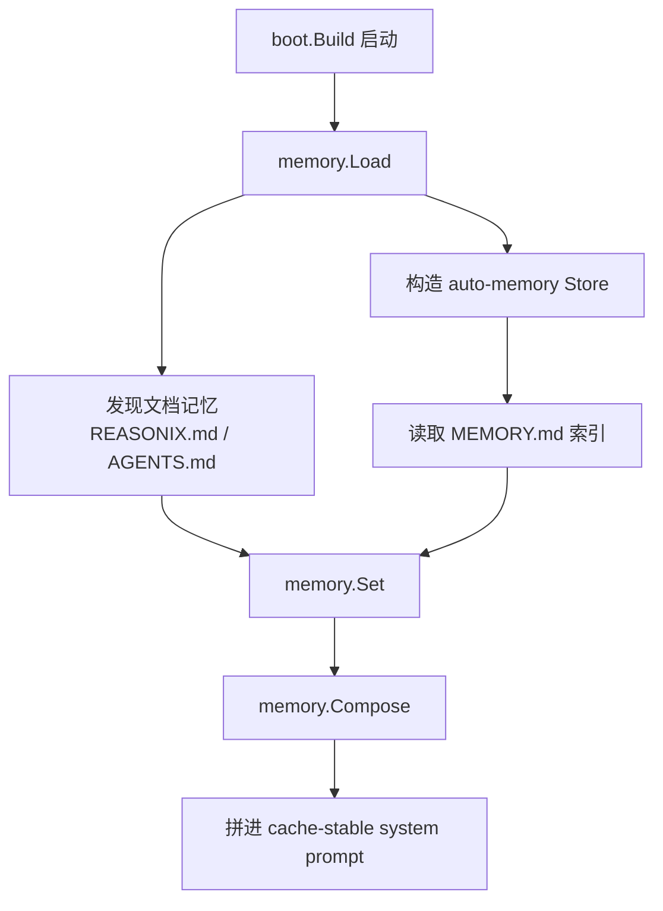
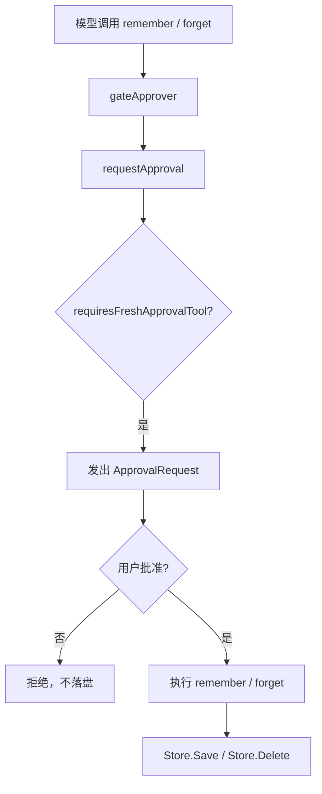
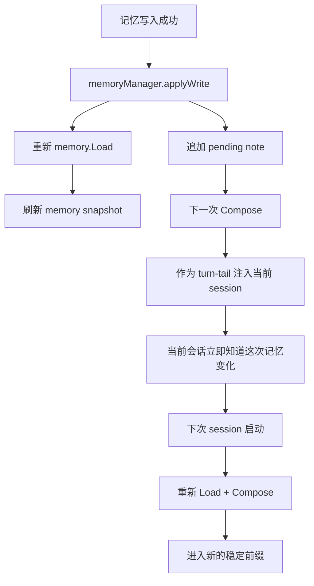

# Session / Memory 检索与持久化说明

这份文档说明 Reasonix 里“持久化记忆”相关的实现，重点回答三个问题：

- 记忆是如何被持久化到磁盘的；
- 系统如何判断“现在该不该持久化”；
- 为什么记忆能在当前会话立刻生效，同时又不去重写 cache-stable system prompt。

实现主线涉及：

- `internal/memory/*`
- `internal/control/memory.go`
- `internal/control/approval.go`
- `internal/boot/boot.go`

## 一句话结论

Reasonix 不会在后台自动把对话“猜测性地”沉淀成持久化记忆。

持久化时机都是显式触发的：

- 用户显式写入文档记忆：`#note`、`/remember <note>`、桌面面板保存；
- agent 显式调用 `remember`；
- 用户或 agent 显式调用 `forget`。

其中 agent 发起的 `remember` / `forget` 每次都必须重新经过人工审批；只有审批通过后，才会真正落盘。

## 记忆分成两层

### 1. 文档记忆

文档记忆是：

- `REASONIX.md`
- `AGENTS.md`
- `AGENTS.local.md`
- 用户目录下的对应记忆文档

这部分由 `memory.Load(...)` 在启动时发现，并由 `memory.Compose(...)` 拼进 system prompt。

适合保存：

- 持续有效的项目规则；
- 用户长期偏好；
- 团队约定；
- 需要每次开场都带上的稳定指导。

### 2. auto-memory

auto-memory 是 `Store` 管理的一组“一条事实一个文件”的 Markdown 文件，加上一份 `MEMORY.md` 索引。

适合保存：

- 被用户批准保留的稳定事实；
- 长期有效但不适合直接写死进文档记忆的结论；
- 可归档、可搜索、可审计的项目/用户/反馈/参考信息。

## 启动时如何加载持久化记忆

启动阶段只做“发现并加载”，不做新写入。

关键点：

- 这一步只读取磁盘上的稳定记忆；
- 读出来的结果在当前 session 内被当成稳定前缀；
- session 运行中新增的记忆不会直接回写这段前缀，而是走“当前会话补丁”路径。

## 谁来决定“现在该不该持久化”

`Store.Save` / `Store.Delete` 不负责做策略判断，它们只负责执行持久化。

真正决定“现在该不该保存/删除”的，是调用入口。

### 显式持久化入口

| 入口 | 触发者 | 是否需要审批 | 最终动作 |
| --- | --- | --- | --- |
| `#note` / `/remember <note>` | 用户 | 不需要，属于直接用户动作 | 追加到文档记忆 |
| 桌面面板保存文档 | 用户 | 不需要，属于直接用户动作 | 覆盖写文档记忆 |
| 桌面面板保存 fact | 用户 | 不需要，属于直接用户动作 | `Store.Save` |
| `remember` 工具 | agent | 需要，每次 fresh approval | `Store.Save` |
| `forget` 工具 | agent | 需要，每次 fresh approval | `Store.Delete` / `Archive` |
| 面板 forget | 用户 | 不需要，属于直接用户动作 | `Store.Delete` / `Archive` |

### 为什么 `remember` / `forget` 每次都要重新审批

因为这不是普通的“工具权限”问题，而是一次新的跨会话决策：

- 这条事实值不值得长期保留？
- 这条旧事实是不是应该停止影响未来会话？

所以控制器把它们归类为 `requiresFreshApprovalTool(...)`：

- 不复用 session grant；
- 不生成 persistent allow rule；
- `auto` / `YOLO` 也不会跳过这类审批。

## `remember` 真正落盘时发生了什么

当 `remember` 工具拿到审批后，会执行：

1. 解析 `name` / `title` / `description` / `type` / `body`；
2. 调用 `Store.Save(...)`；
3. 把事实写成 `<name>.md`；
4. 更新对应目录的 `MEMORY.md` 索引；
5. 如有同名 active 副本，清理另一目录里的重复条目；
6. 通过 `QueueMemory(...)` 给当前 session 补一条 turn-tail note。

`Store.Save(...)` 只做“持久化执行”，不做“要不要保存”的决策。

## `forget` 真正落盘时发生了什么

`forget` 不会硬删除。

它会：

1. 把活动记忆从索引中移除；
2. 把原文件移动到 `.archive/`；
3. 给当前 session 补一条 “已忽略这条记忆” 的 turn-tail note。

所以“忘记”是：

- 停止作为 active memory 参与未来检索；
- 但保留审计与追溯能力。

## 为什么当前会话能立刻生效，却不破坏前缀缓存

这是整套实现的关键设计。

持久化记忆在当前 session 的生效分两步：

1. **落盘 + 重新发现**
   - `memoryManager.applyWrite(...)` 重新 `memory.Load(...)`
   - 让面板/管理视图立刻看到最新 snapshot
2. **排队一条 turn-tail note**
   - 把“刚刚保存/归档了什么”放进 `pending`
   - 下一次 Compose 时，作为会话尾部补丁注入

这样做的好处是：

- 当前 session 立刻感知到记忆变化；
- 不需要重写 cache-stable system prompt；
- 下一次 session 启动时，新记忆会自然进入稳定前缀。

## 当前实现“不会做”的事

### 1. 不会后台自动总结并持久化

系统不会因为：

- 一段对话看起来“挺重要”；
- 某条信息重复出现很多次；
- 命中率很高；
- 会话快结束了；

就自动落盘成持久化记忆。

Reasonix 只提供：

- 检索；
- 显式保存；
- 显式归档；
- 当前 session 立即补丁生效。

### 2. 不会在本 session 中直接重写稳定前缀

mid-session 的记忆变化不会直接改：

- `system prompt`
- tool schema
- 既有稳定前缀

否则会破坏 cache-first 设计。

### 3. 不会自动清理“旧记忆”

旧记忆只有在显式 `forget` 时才会归档。  
系统不会根据“太久没用”“太老”“像重复”自动删除。

## 代码路径速查

### 启动加载

- `memory.Load(...)`
- `memory.Compose(...)`
- `boot.Build(...)`

### 用户直接写入

- `Controller.QuickAdd(...)`
- `Controller.SaveDoc(...)`
- `Controller.SaveMemory(...)`
- `Controller.ForgetMemory(...)`

### agent 写入 / 删除

- `rememberTool.Execute(...)`
- `forgetTool.Execute(...)`
- `gateApprover.Approve(...)`
- `requestApproval(...)`
- `requiresFreshApprovalTool(...)`

### 当前 session 立即生效

- `memoryManager.applyWrite(...)`
- `memoryManager.queue(...)`
- `Controller.QueueMemory(...)`

## 设计取舍

这套机制在三个目标之间做平衡：

- **可审计**：记忆是文件，`forget` 归档而不是硬删；
- **可控**：agent 发起的跨会话写入每次都要用户批准；
- **缓存友好**：当前 session 用 turn-tail note 立即生效，下次 session 再进入稳定前缀。

如果把 mid-session 的记忆变化直接重写进 system prompt，当前 session 会更“即时”，但会明显破坏稳定前缀和缓存形状；当前实现选择了更保守、更稳定的路径。
