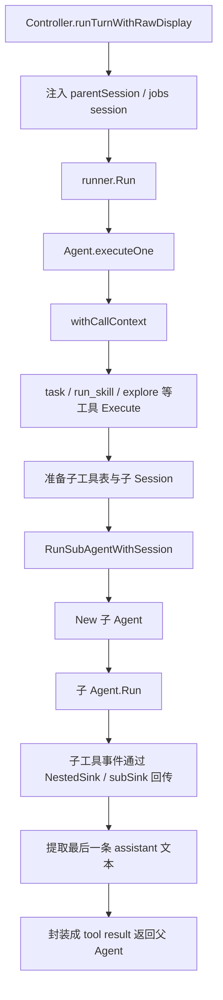
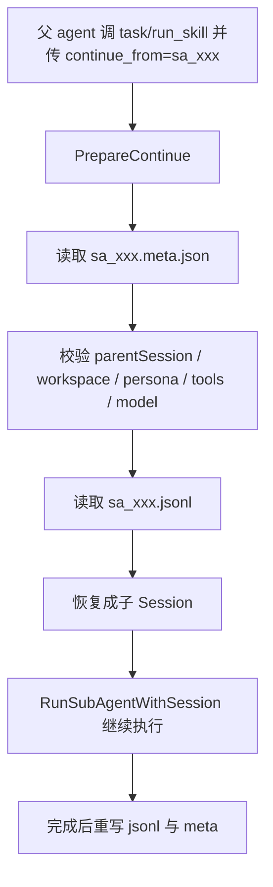
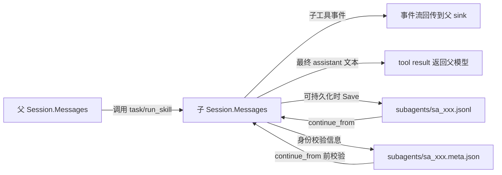

# Subagent 模式调用链

这篇文档说明 Reasonix 里的 subagent 是如何被拉起的、如何与主 agent 沟通、上下文存在哪里，以及何时会持久化。

对应代码入口主要在：

- `internal/control/turn_orchestrator.go`
- `internal/agent/agent.go`
- `internal/agent/task.go`
- `internal/agent/subagent_store.go`
- `internal/boot/boot.go`
- `internal/skill/tools.go`

## 1. 先说结论

Reasonix 的 subagent 不是“把父 agent 的整个上下文复制一份再继续跑”，而是：

1. 主 agent 在某次工具调用里决定派生一个子 agent
2. 框架给子 agent 新建一份独立 `Session`
3. 子 agent 只拿到：
   - 自己的 `system prompt`
   - 这次被委派的 `prompt/task`
   - 一份裁剪过的工具表
4. 子 agent 的中间 tool 过程通过事件流回传给前端
5. 父 agent 最终只收到：
   - 最终答案
   - 可选的 `sa_*` 引用（如果这次子会话被持久化）

所以：

- 主从 agent 的“可视化沟通”靠事件流
- 主从 agent 的“模型上下文传递”靠最终 tool result
- 子 agent 的“历史上下文存储”在它自己的 `Session.Messages`

## 2. 哪些入口会进入 subagent

目前有几类入口会走 subagent 机制：

- `task`
  - 通用可写 subagent
  - 支持 `continue_from`
  - 有父会话时可持久化 transcript
- `read_only_task`
  - 只读研究型 subagent
  - 不支持持久化 continuation
  - 只返回最终答案
- `run_skill`
  - 当 skill 是 `runAs: subagent` 时，走 subagent
  - skill body 会变成子 agent 的 `system prompt`
- 内建 skill wrappers
  - 如 `explore`、`research`、`review`、`security_review`
  - 本质上也是对 subagent runner 的包装
- `parallel_tasks`
  - 会并发拉起多个子 agent
  - 复用相同执行核心
  - 默认是 ephemeral，不走可续接 transcript

## 3. 主调用链

### 3.1 从主回合进入 subagent



### 3.2 `task` 路径

`task.Execute(...)` 里会做几件关键事情：

1. 解析参数：`prompt`、`tools`、`max_steps`、`model`、`effort`、`continue_from`
2. 用 `buildSubReg(...)` 生成子工具表
3. 从 `CallContext(ctx)` 取到：
   - `parentID`
   - `sink`
4. 从 `ParentSession(ctx)` 取到父会话 ID
5. 交给 `prepareTranscriptRun(...)` 决定：
   - fresh subagent
   - continue existing subagent
   - ephemeral subagent
6. 调 `RunSubAgentWithSession(...)` 真正执行
7. 把最终答案包装成 tool result 回给父 agent

## 4. 主 agent 与 subagent 如何沟通

### 4.1 不是共享消息数组

主 agent 和 subagent 不共用同一个 `Session.Messages`。

- 父 agent 有父 agent 自己的 `Session`
- 子 agent 有子 agent 自己的 `Session`

子 agent 的中间消息不会直接插入父 agent 的消息历史。

### 4.2 有两条“沟通线”

#### 第一条：事件流，给前端看过程

`Agent.executeOne(...)` 在执行工具前会用 `withCallContext(...)` 给当前 `ctx` 打上：

- 当前父工具调用 ID
- 父 sink
- asker

随后 `task` / `run_skill` 会把这个上下文交给 `NestedSink(...)` 或 `subSink(...)`。

这样子 agent 发出的：

- `ToolDispatch`
- `ToolResult`
- `Usage`

会被重新打上 `ParentID` 后转发给前端，于是 UI 能把这些事件显示在当前父工具调用下面。

这条线的作用是：

- 让用户看到 subagent 在查什么、调了什么工具
- 但这些内容不进入父模型的 prompt

#### 第二条：tool result，给父模型看最终结果

当 subagent 执行完，`RunSubAgentWithSession(...)` 会倒序扫描子 `Session.Messages`，
找到最后一条有正文的 assistant 消息，把它当作最终答案返回。

父 agent 真正收到的是这次工具调用的输出，也就是：

- 最终答案
- 可选的 `Subagent reference: sa_xxx`

父模型能继续推理的，是这份最终 tool result，而不是整个子 transcript。

## 5. 子上下文存在哪里

### 5.1 运行时：存在子 Session 里

subagent 运行时的上下文保存在独立的 `Session.Messages`：

- 第 1 条通常是 system prompt
- 当前委派任务会作为一条新的 user message 进入子会话
- 后续子 agent 自己的 assistant/tool/tool_result 也都写在这份子会话里

父会话与子会话在内存里是分开的。

### 5.2 持久化时：落在 `subagents/` 目录

如果当前运行拥有父会话 ID，且走的是允许持久化的路径，subagent 会落盘到：

```text
<sessionDir>/subagents/
  sa_20260626_....jsonl
  sa_20260626_....meta.json
```

其中：

- `sa_*.jsonl`
  - 保存完整子会话消息
  - 格式和普通 session 一样，是逐行 JSON 的 `provider.Message`
- `sa_*.meta.json`
  - 保存恢复校验所需的身份信息
  - 包括：
    - `ParentSession`
    - `ParentToolCallID`
    - `Kind`
    - `Name`
    - `WorkspaceRoot`
    - `SystemPromptHash`
    - `ToolScope`
    - `ToolSchemaHash`
    - `Model`
    - `Effort`
    - `Status`

### 5.3 为什么要分成 `jsonl + meta`

因为恢复时要同时解决两件事：

1. 把历史消息恢复出来
2. 确认“这还是不是同一个 subagent 身份”

`jsonl` 负责第 1 件事，`meta` 负责第 2 件事。

## 6. `continue_from` 如何恢复上下文



恢复不是把 `sa_xxx` 的文本总结后重新贴进父 prompt，而是：

1. 找到那份子 transcript 文件
2. `LoadSession(...)`
3. 把它重新变成子 `Session`
4. 在原来的子上下文后面继续追加

这也是为什么 continuation 会校验：

- workspace 是否一致
- system prompt hash 是否一致
- tool scope / schema 是否一致
- model / effort 是否一致

只要这些边界不一致，就拒绝继续，要求新开 subagent。

## 7. 什么时候不会持久化

以下情况通常不会形成可继续的 `sa_*` transcript：

- `reasonix run` 这类没有父会话路径的 headless 运行
- `read_only_task`
- `read_only_skill`
- `parallel_tasks` 的并发子任务

这些路径依然会有独立子 `Session`，但只活在内存里：

- 没有 `sa_*` 引用
- 不落盘
- 不能 `continue_from`

## 8. 启动时会不会把所有 subagent transcript 都加载进来

不会。

启动时只会做一件事：

- 调 `CleanupStaleRunning()`，把上次异常退出后仍标记为 `running` 的 subagent 改成 `interrupted`

真正读取某个 subagent 上下文，发生在：

- 某次 `continue_from=sa_xxx`
- 或某次祖先分支恢复/fork 命中这个引用

也就是说，subagent transcript 是按需加载，不是启动全量预热。

## 9. 与主 agent 的上下文边界

可以把边界理解成三层：

### 9.1 主 agent 看到什么

主 agent 看到：

- 当前工具调用的最终输出
- 可选的 `sa_*` 引用

### 9.2 前端看到什么

前端可以看到：

- 子工具 dispatch/result
- 子 usage

因为这些通过嵌套事件流被转发出来了。

### 9.3 子 agent 自己保留什么

子 agent 自己保留：

- 它完整的消息历史
- 它自己的 tool 调用序列
- 它自己的 compaction 后上下文

这些保存在子 `Session.Messages`，必要时再持久化到 `subagents/sa_*.jsonl`。

## 10. 一张总图



## 11. 判断问题时可以抓住的几个关键点

- subagent 的上下文不在父 prompt 里，而在它自己的 `Session.Messages`
- 主从 agent 不共享 transcript，只共享最终结果与事件流
- `continue_from` 是加载旧子 Session 继续跑，不是把旧内容摘要后塞回父会话
- 可视化过程和模型可见上下文是两回事：
  - 事件流给前端
  - tool result 给父模型
- 启动时不会预加载所有 subagent transcript，只会做 stale-running 清理
